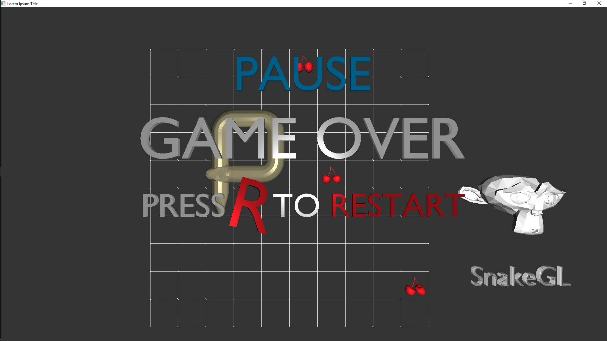

# snakeGL
Projekt na programowanie obiektowe (2 semestr).
Kiedys to bedzie 3d snake replica.
Poza plikami w repo dolaczyc do projektu nalezy takze foldery z glfw i glew.
Peace.

Wersja openGLa -> 4.5

Kompilator -> MSVC

Wykorzystane biblioteki zewnetrzne:
- Glew (do zarzadzania GL-em)
- Glfw (do zarzadzania oknem)
- Soil2 (do ladowania obrazow)
- Glm (biblioteka matematyczna)

Snake model concept:

Current game state of preparation:

I hate C++, my dudes, but i will finish this one project. I guess...

Todo:
- bonusy
- punktacja
- menu, a w nim:
  - szybka gra z bonusami
  - szybka gra klasyczna
  - customowa gra, konfigurowalne elementy to:
    - wysokosc planszy
    - szerokosc planszy
    - ktore bonusy maja sie pojawiac
    - co ile i na ile tickow maja sie pojawiac
    - ilosc owocow na planszy
    - szybkosc weza
  - scoreboard z najlepszymi wynikami
  - exit
- muzyka
